# 🏆 2026 World Cup Bracket Results

**Last updated:** 2026-07-23T21:52:41.238959+00:00

## 🎯 Summary

- 👑 **Predicted Champion:** 🇪🇸 Spain (16.9%)
- 🌟 **Predicted Final:** 🇦🇷 Argentina vs 🇪🇸 Spain
- 📊 **Expected Score:** 97.53 / 203

## 📈 Scoring Summary

**Current Score: 158 / 203 (77.8%)**

**Accuracy: 84/111 correct (75.7%)**

| Stage | Correct | Pts/Pick | Max | Pts Earned |
|:---|:---:|:---:|:---:|:---:|
| Group Placement | 35/48 | 1 | 48 | **35** |
| Advance to Knockout | 26/32 | 1 | 32 | **26** |
| Advance to Round of 32 | 12/16 | 2 | 32 | **24** |
| Advance to Quarterfinal | 5/8 | 4 | 32 | **20** |
| Advance to Semifinal | 3/4 | 6 | 24 | **18** |
| Finalist | 2/2 | 10 | 20 | **20** |
| Champion | 1/1 | 15 | 15 | **15** |
| **Total** | | | **203** | **158** |

## 🗺️ Bracket Progress vs Prediction

One chart with stage rows read **top → bottom**. Within each row, the requested groups run **left → right**.

- 🟢 **Green** — predicted correctly for this stage
- 🟡 **Yellow** — partial group placement hit
- 🔴 **Red** — miss / upset vs prediction
- ⚪ **Gray** — not resolved yet
- `*` on a score — decided in extra time or penalties

**Predicted deep run:** Champion: Spain · Final: Argentina vs Spain · SF: Argentina, Brazil, France, Spain

```mermaid
%%{init: {"flowchart": {"useMaxWidth": false, "nodeSpacing": 48, "rankSpacing": 48}, "themeVariables": {"fontSize": "14px"}}}%%
flowchart TB
  classDef hit fill:#d1fae5,stroke:#059669,color:#064e3b,stroke-width:2px
  classDef miss fill:#fee2e2,stroke:#dc2626,color:#7f1d1d,stroke-width:2px
  classDef partial fill:#fef9c3,stroke:#ca8a04,color:#713f12,stroke-width:2px
  classDef pending fill:#f3f4f6,stroke:#9ca3af,color:#374151,stroke-width:1px
  classDef champ fill:#fef3c7,stroke:#d97706,color:#78350f,stroke-width:3px

  subgraph sgPlacement["1. Placement"]
    direction LR
    subgraph placeAD["Groups A–D"]
      direction TB
      grpA["A: 1/4 🇲🇽 Mexico+ 🇰🇷 S. Korea× 🇨🇿 Czechia× 🇿🇦 S. Africa×"]:::partial
      grpB["B: 4/4 🇨🇭 Swiss+ 🇨🇦 Canada+ 🇧🇦 Bosnia+ 🇶🇦 Qatar+"]:::hit
      grpC["C: 4/4 🇧🇷 Brazil+ 🇲🇦 Morocco+ 🏴󠁧󠁢󠁳󠁣󠁴󠁿 Scotland+ 🇭🇹 Haiti+"]:::hit
      grpD["D: 1/4 🇹🇷 Turkey× 🇺🇸 USA× 🇵🇾 Paraguay+ 🇦🇺 Australia×"]:::partial
      grpA --> grpB
      grpB --> grpC
      grpC --> grpD
    end
    subgraph placeEH["Groups E–H"]
      direction TB
      grpE["E: 2/4 🇩🇪 Germany+ 🇪🇨 Ecuador× 🇨🇮 C. d'Ivoire× 🇨🇼 Curaçao+"]:::partial
      grpF["F: 4/4 🇳🇱 Neth.+ 🇯🇵 Japan+ 🇸🇪 Sweden+ 🇹🇳 Tunisia+"]:::hit
      grpG["G: 4/4 🇧🇪 Belgium+ 🇪🇬 Egypt+ 🇮🇷 Iran+ 🇳🇿 N. Zealand+"]:::hit
      grpH["H: 1/4 🇪🇸 Spain+ 🇺🇾 Uruguay× 🇸🇦 Saudi× 🇨🇻 C. Verde×"]:::partial
      grpE --> grpF
      grpF --> grpG
      grpG --> grpH
    end
    subgraph placeIL["Groups I–L"]
      direction TB
      grpI["I: 4/4 🇫🇷 France+ 🇳🇴 Norway+ 🇸🇳 Senegal+ 🇮🇶 Iraq+"]:::hit
      grpJ["J: 4/4 🇦🇷 Argentina+ 🇦🇹 Austria+ 🇩🇿 Algeria+ 🇯🇴 Jordan+"]:::hit
      grpK["K: 2/4 🇵🇹 Portugal× 🇨🇴 Colombia× 🇨🇩 DR Congo+ 🇺🇿 Uzbekistan+"]:::partial
      grpL["L: 4/4 🏴󠁧󠁢󠁥󠁮󠁧󠁿 England+ 🇭🇷 Croatia+ 🇬🇭 Ghana+ 🇵🇦 Panama+"]:::hit
      grpI --> grpJ
      grpJ --> grpK
      grpK --> grpL
    end
    placeAD --> placeEH
    placeEH --> placeIL
  end

  subgraph sgKnockout["2. Knockout"]
    direction LR
    subgraph koPath97["QF 97"]
      direction TB
      m73["R32: 🇿🇦 S. Africa 0-1 🇨🇦 Canada → 🇨🇦 Canada"]:::hit
      m75["R32: 🇳🇱 Neth. 1-1* 🇲🇦 Morocco → 🇲🇦 Morocco"]:::miss
      m74["R32: 🇩🇪 Germany 1-1* 🇵🇾 Paraguay → 🇵🇾 Paraguay"]:::miss
      m77["R32: 🇫🇷 France 3-0 🇸🇪 Sweden → 🇫🇷 France"]:::hit
      m73 --> m75
      m75 --> m74
      m74 --> m77
    end
    subgraph koPath98["QF 98"]
      direction TB
      m81["R32: 🇺🇸 USA 2-0 🇧🇦 Bosnia → 🇺🇸 USA"]:::hit
      m82["R32: 🇧🇪 Belgium 3-2* 🇸🇳 Senegal → 🇧🇪 Belgium"]:::hit
      m83["R32: 🇵🇹 Portugal 2-1 🇭🇷 Croatia → 🇵🇹 Portugal"]:::hit
      m84["R32: 🇪🇸 Spain 3-0 🇦🇹 Austria → 🇪🇸 Spain"]:::hit
      m81 --> m82
      m82 --> m83
      m83 --> m84
    end
    subgraph koPath99["QF 99"]
      direction TB
      m76["R32: 🇧🇷 Brazil 2-1 🇯🇵 Japan → 🇧🇷 Brazil"]:::hit
      m78["R32: 🇨🇮 C. d'Ivoire 1-2 🇳🇴 Norway → 🇳🇴 Norway"]:::miss
      m79["R32: 🇲🇽 Mexico 2-0 🇪🇨 Ecuador → 🇲🇽 Mexico"]:::hit
      m80["R32: 🏴󠁧󠁢󠁥󠁮󠁧󠁿 England 2-1 🇨🇩 DR Congo → 🏴󠁧󠁢󠁥󠁮󠁧󠁿 England"]:::hit
      m76 --> m78
      m78 --> m79
      m79 --> m80
    end
    subgraph koPath100["QF 100"]
      direction TB
      m85["R32: 🇨🇭 Swiss 2-0 🇩🇿 Algeria → 🇨🇭 Swiss"]:::hit
      m87["R32: 🇨🇴 Colombia 1-0 🇬🇭 Ghana → 🇨🇴 Colombia"]:::hit
      m86["R32: 🇦🇷 Argentina 3-2* 🇨🇻 C. Verde → 🇦🇷 Argentina"]:::hit
      m88["R32: 🇦🇺 Australia 1-1* 🇪🇬 Egypt → 🇪🇬 Egypt"]:::miss
      m85 --> m87
      m87 --> m86
      m86 --> m88
    end
    koPath97 --> koPath98
    koPath98 --> koPath99
    koPath99 --> koPath100
  end

  subgraph sgR16["3. R16"]
    direction LR
    subgraph r16Path97["QF 97"]
      direction TB
      m90["R16: 🇨🇦 Canada 0-3 🇲🇦 Morocco → 🇲🇦 Morocco"]:::miss
      m89["R16: 🇵🇾 Paraguay 0-1 🇫🇷 France → 🇫🇷 France"]:::hit
      m90 --> m89
    end
    subgraph r16Path98["QF 98"]
      direction TB
      m94["R16: 🇺🇸 USA 1-4 🇧🇪 Belgium → 🇧🇪 Belgium"]:::hit
      m93["R16: 🇵🇹 Portugal 0-1 🇪🇸 Spain → 🇪🇸 Spain"]:::hit
      m94 --> m93
    end
    subgraph r16Path99["QF 99"]
      direction TB
      m91["R16: 🇧🇷 Brazil 1-2 🇳🇴 Norway → 🇳🇴 Norway"]:::miss
      m92["R16: 🇲🇽 Mexico 2-3 🏴󠁧󠁢󠁥󠁮󠁧󠁿 England → 🏴󠁧󠁢󠁥󠁮󠁧󠁿 England"]:::hit
      m91 --> m92
    end
    subgraph r16Path100["QF 100"]
      direction TB
      m96["R16: 🇨🇭 Swiss 0-0* 🇨🇴 Colombia → 🇨🇭 Swiss"]:::miss
      m95["R16: 🇦🇷 Argentina 3-2 🇪🇬 Egypt → 🇦🇷 Argentina"]:::hit
      m96 --> m95
    end
    r16Path97 --> r16Path98
    r16Path98 --> r16Path99
    r16Path99 --> r16Path100
  end

  subgraph sgQF["4. QF"]
    direction LR
    subgraph qfPath97["QF 97"]
      direction TB
      m97["QF: 🇫🇷 France 2-0 🇲🇦 Morocco → 🇫🇷 France"]:::hit
    end
    subgraph qfPath98["QF 98"]
      direction TB
      m98["QF: 🇪🇸 Spain 2-1 🇧🇪 Belgium → 🇪🇸 Spain"]:::hit
    end
    subgraph qfPath99["QF 99"]
      direction TB
      m99["QF: 🇳🇴 Norway 1-2* 🏴󠁧󠁢󠁥󠁮󠁧󠁿 England → 🏴󠁧󠁢󠁥󠁮󠁧󠁿 England"]:::miss
    end
    subgraph qfPath100["QF 100"]
      direction TB
      m100["QF: 🇦🇷 Argentina 3-1* 🇨🇭 Swiss → 🇦🇷 Argentina"]:::hit
    end
    qfPath97 --> qfPath98
    qfPath98 --> qfPath99
    qfPath99 --> qfPath100
  end

  subgraph sgSF["5. SF"]
    direction LR
    subgraph sfPath101["SF 101 · W97 vs W98"]
      direction TB
      m101["SF: 🇫🇷 France 0-2 🇪🇸 Spain → 🇪🇸 Spain"]:::hit
    end
    subgraph sfPath102["SF 102 · W99 vs W100"]
      direction TB
      m102["SF: 🏴󠁧󠁢󠁥󠁮󠁧󠁿 England 1-2 🇦🇷 Argentina → 🇦🇷 Argentina"]:::hit
    end
    sfPath101 --> sfPath102
  end

  subgraph sgFinalists["6. Finalists"]
    direction LR
    m104["F: 🇪🇸 Spain 1-0* 🇦🇷 Argentina → 🇪🇸 Spain"]:::hit
  end

  subgraph sgWinner["7. Winner"]
    direction LR
    champion["Champion: 🇪🇸 Spain"]:::champ
  end

  sgPlacement --> sgKnockout
  sgKnockout --> sgR16
  sgR16 --> sgQF
  sgQF --> sgSF
  sgSF --> sgFinalists
  sgFinalists --> sgWinner
```

### Knockout prediction hits

| Stage | Predicted teams that arrived | Misses |
|:---|:---|:---|
| R16 | Argentina, Belgium, Brazil, Canada, Colombia, England, France, Mexico, Portugal, Spain, Switzerland, USA | Ecuador, Germany, Netherlands, Turkey |
| QF | Argentina, Belgium, England, France, Spain | Brazil, Netherlands, Portugal |
| SF | Argentina, France, Spain | Brazil |
| Final | Argentina, Spain | — |
| Champion | Spain | — |

## 📊 Group Placements

### Group A — ✅ Final

| Pos | Predicted | Actual | Pts | GD | Pld | Result |
|:---:|:---|:---|:---:|:---:|:---:|:---:|
| 1st | 🇲🇽 Mexico | 🇲🇽 Mexico | 9 | +6 | 3 | ✅ |
| 2nd | 🇰🇷 South Korea | 🇿🇦 South Africa | 4 | -1 | 3 | ❌ |
| 3rd | 🇨🇿 Czech Republic | 🇰🇷 South Korea | 3 | -1 | 3 | ❌ |
| 4th | 🇿🇦 South Africa | 🇨🇿 Czech Republic | 1 | -4 | 3 | ❌ |

### Group B — ✅ Final

| Pos | Predicted | Actual | Pts | GD | Pld | Result |
|:---:|:---|:---|:---:|:---:|:---:|:---:|
| 1st | 🇨🇭 Switzerland | 🇨🇭 Switzerland | 7 | +4 | 3 | ✅ |
| 2nd | 🇨🇦 Canada | 🇨🇦 Canada | 4 | +5 | 3 | ✅ |
| 3rd | 🇧🇦 Bosnia and Herzegovina | 🇧🇦 Bosnia & Herzegovina | 4 | -1 | 3 | ✅ |
| 4th | 🇶🇦 Qatar | 🇶🇦 Qatar | 1 | -8 | 3 | ✅ |

### Group C — ✅ Final

| Pos | Predicted | Actual | Pts | GD | Pld | Result |
|:---:|:---|:---|:---:|:---:|:---:|:---:|
| 1st | 🇧🇷 Brazil | 🇧🇷 Brazil | 7 | +6 | 3 | ✅ |
| 2nd | 🇲🇦 Morocco | 🇲🇦 Morocco | 7 | +3 | 3 | ✅ |
| 3rd | 🏴󠁧󠁢󠁳󠁣󠁴󠁿 Scotland | 🏴󠁧󠁢󠁳󠁣󠁴󠁿 Scotland | 3 | -3 | 3 | ✅ |
| 4th | 🇭🇹 Haiti | 🇭🇹 Haiti | 0 | -6 | 3 | ✅ |

### Group D — ✅ Final

| Pos | Predicted | Actual | Pts | GD | Pld | Result |
|:---:|:---|:---|:---:|:---:|:---:|:---:|
| 1st | 🇹🇷 Turkey | 🇺🇸 USA | 6 | +4 | 3 | ❌ |
| 2nd | 🇺🇸 USA | 🇦🇺 Australia | 4 | 0 | 3 | ❌ |
| 3rd | 🇵🇾 Paraguay | 🇵🇾 Paraguay | 4 | -2 | 3 | ✅ |
| 4th | 🇦🇺 Australia | 🇹🇷 Turkey | 3 | -2 | 3 | ❌ |

### Group E — ✅ Final

| Pos | Predicted | Actual | Pts | GD | Pld | Result |
|:---:|:---|:---|:---:|:---:|:---:|:---:|
| 1st | 🇩🇪 Germany | 🇩🇪 Germany | 6 | +6 | 3 | ✅ |
| 2nd | 🇪🇨 Ecuador | 🇨🇮 Ivory Coast | 6 | +2 | 3 | ❌ |
| 3rd | 🇨🇮 Ivory Coast | 🇪🇨 Ecuador | 4 | 0 | 3 | ❌ |
| 4th | 🇨🇼 Curaçao | 🇨🇼 Curaçao | 1 | -8 | 3 | ✅ |

### Group F — ✅ Final

| Pos | Predicted | Actual | Pts | GD | Pld | Result |
|:---:|:---|:---|:---:|:---:|:---:|:---:|
| 1st | 🇳🇱 Netherlands | 🇳🇱 Netherlands | 7 | +6 | 3 | ✅ |
| 2nd | 🇯🇵 Japan | 🇯🇵 Japan | 5 | +4 | 3 | ✅ |
| 3rd | 🇸🇪 Sweden | 🇸🇪 Sweden | 4 | 0 | 3 | ✅ |
| 4th | 🇹🇳 Tunisia | 🇹🇳 Tunisia | 0 | -10 | 3 | ✅ |

### Group G — ✅ Final

| Pos | Predicted | Actual | Pts | GD | Pld | Result |
|:---:|:---|:---|:---:|:---:|:---:|:---:|
| 1st | 🇧🇪 Belgium | 🇧🇪 Belgium | 5 | +4 | 3 | ✅ |
| 2nd | 🇪🇬 Egypt | 🇪🇬 Egypt | 5 | +2 | 3 | ✅ |
| 3rd | 🇮🇷 Iran | 🇮🇷 Iran | 3 | 0 | 3 | ✅ |
| 4th | 🇳🇿 New Zealand | 🇳🇿 New Zealand | 1 | -6 | 3 | ✅ |

### Group H — ✅ Final

| Pos | Predicted | Actual | Pts | GD | Pld | Result |
|:---:|:---|:---|:---:|:---:|:---:|:---:|
| 1st | 🇪🇸 Spain | 🇪🇸 Spain | 7 | +5 | 3 | ✅ |
| 2nd | 🇺🇾 Uruguay | 🇨🇻 Cape Verde | 3 | 0 | 3 | ❌ |
| 3rd | 🇸🇦 Saudi Arabia | 🇺🇾 Uruguay | 2 | -1 | 3 | ❌ |
| 4th | 🇨🇻 Cape Verde | 🇸🇦 Saudi Arabia | 2 | -4 | 3 | ❌ |

### Group I — ✅ Final

| Pos | Predicted | Actual | Pts | GD | Pld | Result |
|:---:|:---|:---|:---:|:---:|:---:|:---:|
| 1st | 🇫🇷 France | 🇫🇷 France | 9 | +8 | 3 | ✅ |
| 2nd | 🇳🇴 Norway | 🇳🇴 Norway | 6 | +1 | 3 | ✅ |
| 3rd | 🇸🇳 Senegal | 🇸🇳 Senegal | 3 | +2 | 3 | ✅ |
| 4th | 🇮🇶 Iraq | 🇮🇶 Iraq | 0 | -11 | 3 | ✅ |

### Group J — ✅ Final

| Pos | Predicted | Actual | Pts | GD | Pld | Result |
|:---:|:---|:---|:---:|:---:|:---:|:---:|
| 1st | 🇦🇷 Argentina | 🇦🇷 Argentina | 9 | +7 | 3 | ✅ |
| 2nd | 🇦🇹 Austria | 🇦🇹 Austria | 4 | 0 | 3 | ✅ |
| 3rd | 🇩🇿 Algeria | 🇩🇿 Algeria | 4 | -2 | 3 | ✅ |
| 4th | 🇯🇴 Jordan | 🇯🇴 Jordan | 0 | -5 | 3 | ✅ |

### Group K — ✅ Final

| Pos | Predicted | Actual | Pts | GD | Pld | Result |
|:---:|:---|:---|:---:|:---:|:---:|:---:|
| 1st | 🇵🇹 Portugal | 🇨🇴 Colombia | 7 | +3 | 3 | ❌ |
| 2nd | 🇨🇴 Colombia | 🇵🇹 Portugal | 5 | +5 | 3 | ❌ |
| 3rd | 🇨🇩 DR Congo | 🇨🇩 DR Congo | 4 | +1 | 3 | ✅ |
| 4th | 🇺🇿 Uzbekistan | 🇺🇿 Uzbekistan | 0 | -9 | 3 | ✅ |

### Group L — ✅ Final

| Pos | Predicted | Actual | Pts | GD | Pld | Result |
|:---:|:---|:---|:---:|:---:|:---:|:---:|
| 1st | 🏴󠁧󠁢󠁥󠁮󠁧󠁿 England | 🏴󠁧󠁢󠁥󠁮󠁧󠁿 England | 7 | +4 | 3 | ✅ |
| 2nd | 🇭🇷 Croatia | 🇭🇷 Croatia | 6 | 0 | 3 | ✅ |
| 3rd | 🇬🇭 Ghana | 🇬🇭 Ghana | 4 | 0 | 3 | ✅ |
| 4th | 🇵🇦 Panama | 🇵🇦 Panama | 0 | -4 | 3 | ✅ |

## 🏆 Predicted Knockout Picks

### Round of 32

- 🇩🇿 Algeria (66.1%)
- 🇦🇷 Argentina (96.4%) 🌟
- 🇦🇹 Austria (77.7%)
- 🇧🇪 Belgium (94.7%) 💎
- 🇧🇦 Bosnia and Herzegovina (62.0%)
- 🇧🇷 Brazil (96.5%) 🏅
- 🇨🇦 Canada (88.8%) 🔥
- 🇨🇴 Colombia (90.2%) 🔥
- 🇭🇷 Croatia (84.6%)
- 🇨🇿 Czech Republic (67.2%)
- 🇪🇨 Ecuador (87.9%) 🔥
- 🇪🇬 Egypt (71.5%)
- 🏴󠁧󠁢󠁥󠁮󠁧󠁿 England (95.8%) 💎
- 🇫🇷 France (95.8%) 🏅
- 🇩🇪 Germany (96.8%) 🔥
- 🇮🇷 Iran (69.3%)
- 🇨🇮 Ivory Coast (75.8%)
- 🇯🇵 Japan (80.0%)
- 🇲🇽 Mexico (91.1%) 🔥
- 🇲🇦 Morocco (83.5%)
- 🇳🇱 Netherlands (89.3%) 💎
- 🇳🇴 Norway (84.4%)
- 🇵🇾 Paraguay (64.7%)
- 🇵🇹 Portugal (94.5%) 💎
- 🏴󠁧󠁢󠁳󠁣󠁴󠁿 Scotland (64.7%)
- 🇸🇳 Senegal (70.2%)
- 🇰🇷 South Korea (70.1%)
- 🇪🇸 Spain (98.3%) 👑
- 🇨🇭 Switzerland (93.4%) 🔥
- 🇹🇷 Turkey (80.1%) 🔥
- 🇺🇸 USA (78.1%) 🔥
- 🇺🇾 Uruguay (87.0%)

### Round of 16

- 🔥 🇦🇷 Argentina (96.4%) 🌟
- 🔥 🇧🇪 Belgium (94.7%) 💎
- 🔥 🇧🇷 Brazil (96.5%) 🏅
- 🔥 🇨🇦 Canada (88.8%) 🔥
- 🔥 🇨🇴 Colombia (90.2%) 🔥
- 🔥 🇪🇨 Ecuador (87.9%) 🔥
- 🔥 🏴󠁧󠁢󠁥󠁮󠁧󠁿 England (95.8%) 💎
- 🔥 🇫🇷 France (95.8%) 🏅
- 🔥 🇩🇪 Germany (96.8%) 🔥
- 🔥 🇲🇽 Mexico (91.1%) 🔥
- 🔥 🇳🇱 Netherlands (89.3%) 💎
- 🔥 🇵🇹 Portugal (94.5%) 💎
- 🔥 🇪🇸 Spain (98.3%) 👑
- 🔥 🇨🇭 Switzerland (93.4%) 🔥
- 🔥 🇹🇷 Turkey (80.1%) 🔥
- 🔥 🇺🇸 USA (78.1%) 🔥

### Quarter-Finals

- 💥 🇦🇷 Argentina (96.4%) 🌟
- 💥 🇧🇪 Belgium (94.7%) 💎
- 💥 🇧🇷 Brazil (96.5%) 🏅
- 💥 🏴󠁧󠁢󠁥󠁮󠁧󠁿 England (95.8%) 💎
- 💥 🇫🇷 France (95.8%) 🏅
- 💥 🇳🇱 Netherlands (89.3%) 💎
- 💥 🇵🇹 Portugal (94.5%) 💎
- 💥 🇪🇸 Spain (98.3%) 👑

### Semi-Finals

- 🏆 🇦🇷 Argentina (96.4%) 🌟
- 🏆 🇧🇷 Brazil (96.5%) 🏅
- 🏆 🇫🇷 France (95.8%) 🏅
- 🏆 🇪🇸 Spain (98.3%) 👑

### Final

- 🌟 🇦🇷 Argentina (96.4%) 🌟
- 🌟 🇪🇸 Spain (98.3%) 👑

### 👑 Champion: 🇪🇸 Spain

## 🏅 Champion Probabilities

| Rank | Team | Probability |
|:---:|:---:|:---:|
| 🥇 | 🇪🇸 Spain | 16.9% |
| 🥈 | 🇦🇷 Argentina | 14.8% |
| 🥉 | 🇫🇷 France | 12.9% |
| 4. | 🇧🇷 Brazil | 8.6% |
| 5. | 🏴󠁧󠁢󠁥󠁮󠁧󠁿 England | 8.1% |
| 6. | 🇵🇹 Portugal | 5.2% |
| 7. | 🇳🇱 Netherlands | 4.9% |
| 8. | 🇩🇪 Germany | 4.9% |
| 9. | 🇧🇪 Belgium | 3.0% |
| 10. | 🇨🇴 Colombia | 3.0% |
| 11. | 🇭🇷 Croatia | 2.4% |
| 12. | 🇲🇦 Morocco | 2.3% |
| 13. | 🇯🇵 Japan | 1.7% |
| 14. | 🇺🇾 Uruguay | 1.7% |
| 15. | 🇲🇽 Mexico | 1.6% |

## ⚙️ Simulation Config

- **Model:** consensus
- **Simulations:** 1,000,000
- **Seed:** 42
- **Simulation accuracy:** ±0.05% (SE bound at p=0.5)
- **Strategy:** ev-bracket
- **Probabilities:** sim
- **Generated:** 2026-06-11T20:44:44.302977+00:00

### ✅ All Invariants Passed

### Validation vs UAnalyse Priors (MAD)

| Stage | MAD |
|:---|:---:|
| R32 | 0.0621 |
| QF | 0.0393 |
| SF | 0.0263 |
| FINAL | 0.0154 |
| CHAMPION | 0.0085 |

## 📋 Full Team Probabilities

| Team | Flag | R32 | R16 | QF | SF | Final | Champion |
|:---|:---:|:---:|:---:|:---:|:---:|:---:|:---:|
| Spain | 🇪🇸 | 98.3% | 72.3% | 52.5% | 39.6% | 26.5% | 16.9% |
| Argentina | 🇦🇷 | 96.4% | 65.5% | 50.7% | 36.6% | 23.9% | 14.8% |
| France | 🇫🇷 | 95.8% | 73.4% | 50.6% | 34.5% | 21.2% | 12.9% |
| Brazil | 🇧🇷 | 96.5% | 64.9% | 44.0% | 27.3% | 15.6% | 8.6% |
| England | 🏴󠁧󠁢󠁥󠁮󠁧󠁿 | 95.8% | 67.0% | 43.9% | 26.4% | 15.1% | 8.1% |
| Portugal | 🇵🇹 | 94.5% | 61.8% | 37.9% | 21.0% | 10.9% | 5.2% |
| Netherlands | 🇳🇱 | 89.3% | 53.0% | 35.4% | 19.5% | 10.1% | 4.9% |
| Germany | 🇩🇪 | 96.8% | 66.0% | 35.9% | 20.5% | 10.3% | 4.9% |
| Belgium | 🇧🇪 | 94.7% | 62.7% | 36.7% | 15.9% | 7.3% | 3.0% |
| Colombia | 🇨🇴 | 90.2% | 53.3% | 28.8% | 14.8% | 7.0% | 3.0% |
| Croatia | 🇭🇷 | 84.6% | 47.6% | 24.4% | 12.7% | 5.9% | 2.4% |
| Morocco | 🇲🇦 | 83.5% | 45.3% | 26.6% | 12.8% | 5.7% | 2.3% |
| Japan | 🇯🇵 | 80.0% | 39.8% | 22.3% | 10.2% | 4.3% | 1.7% |
| Uruguay | 🇺🇾 | 87.0% | 41.0% | 22.4% | 11.1% | 4.6% | 1.7% |
| Mexico | 🇲🇽 | 91.1% | 54.3% | 24.8% | 10.4% | 4.3% | 1.6% |
| Switzerland | 🇨🇭 | 93.4% | 55.8% | 24.8% | 9.9% | 3.8% | 1.3% |
| Senegal | 🇸🇳 | 70.2% | 38.9% | 18.6% | 8.0% | 3.2% | 1.2% |
| Ecuador | 🇪🇨 | 87.9% | 46.0% | 19.1% | 7.9% | 2.9% | 1.0% |
| USA | 🇺🇸 | 78.1% | 43.1% | 19.2% | 7.3% | 2.8% | 0.9% |
| Canada | 🇨🇦 | 88.8% | 45.5% | 16.6% | 5.4% | 1.7% | 0.5% |
| South Korea | 🇰🇷 | 70.1% | 35.0% | 13.5% | 4.5% | 1.5% | 0.4% |
| Iran | 🇮🇷 | 69.3% | 34.5% | 13.0% | 4.4% | 1.4% | 0.4% |
| Australia | 🇦🇺 | 48.4% | 23.9% | 9.8% | 3.7% | 1.3% | 0.4% |
| Ivory Coast | 🇨🇮 | 75.8% | 32.4% | 11.4% | 3.6% | 1.1% | 0.3% |
| Norway | 🇳🇴 | 84.4% | 31.7% | 9.6% | 2.8% | 0.8% | 0.2% |
| Egypt | 🇪🇬 | 71.5% | 31.1% | 10.2% | 3.0% | 0.8% | 0.2% |
| Turkey | 🇹🇷 | 80.1% | 32.7% | 10.3% | 2.7% | 0.7% | 0.2% |
| Algeria | 🇩🇿 | 66.1% | 20.1% | 7.5% | 2.4% | 0.6% | 0.2% |
| Austria | 🇦🇹 | 77.7% | 21.4% | 7.5% | 2.4% | 0.6% | 0.1% |
| Paraguay | 🇵🇾 | 64.7% | 25.3% | 7.9% | 2.2% | 0.6% | 0.1% |
| Sweden | 🇸🇪 | 61.2% | 19.4% | 6.7% | 1.9% | 0.5% | 0.1% |
| Tunisia | 🇹🇳 | 38.3% | 12.7% | 4.5% | 1.3% | 0.3% | 0.1% |
| Scotland | 🏴󠁧󠁢󠁳󠁣󠁴󠁿 | 64.7% | 18.9% | 6.0% | 1.6% | 0.4% | 0.1% |
| Czech Republic | 🇨🇿 | 67.2% | 24.5% | 6.8% | 1.6% | 0.4% | 0.1% |
| Uzbekistan | 🇺🇿 | 39.0% | 11.8% | 3.8% | 1.1% | 0.3% | 0.1% |
| DR Congo | 🇨🇩 | 39.8% | 12.0% | 3.9% | 1.1% | 0.3% | 0.1% |
| Cape Verde | 🇨🇻 | 35.9% | 11.3% | 4.0% | 1.1% | 0.3% | 0.1% |
| Ghana | 🇬🇭 | 43.1% | 12.3% | 3.8% | 1.1% | 0.3% | 0.1% |
| Saudi Arabia | 🇸🇦 | 37.3% | 10.8% | 3.6% | 0.9% | 0.2% | 0.0% |
| Bosnia and Herzegovina | 🇧🇦 | 62.0% | 20.8% | 5.2% | 1.1% | 0.2% | 0.0% |
| Panama | 🇵🇦 | 40.1% | 10.0% | 2.8% | 0.7% | 0.1% | 0.0% |
| Iraq | 🇮🇶 | 18.2% | 6.6% | 2.1% | 0.5% | 0.1% | 0.0% |
| South Africa | 🇿🇦 | 39.6% | 12.3% | 3.1% | 0.6% | 0.1% | 0.0% |
| New Zealand | 🇳🇿 | 31.5% | 10.0% | 2.4% | 0.5% | 0.1% | 0.0% |
| Curaçao | 🇨🇼 | 11.6% | 4.3% | 1.3% | 0.3% | 0.1% | 0.0% |
| Qatar | 🇶🇦 | 22.8% | 7.3% | 1.8% | 0.3% | 0.1% | 0.0% |
| Jordan | 🇯🇴 | 25.3% | 5.3% | 1.3% | 0.3% | 0.0% | 0.0% |
| Haiti | 🇭🇹 | 21.7% | 4.4% | 0.9% | 0.2% | 0.0% | 0.0% |
